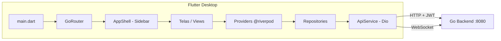
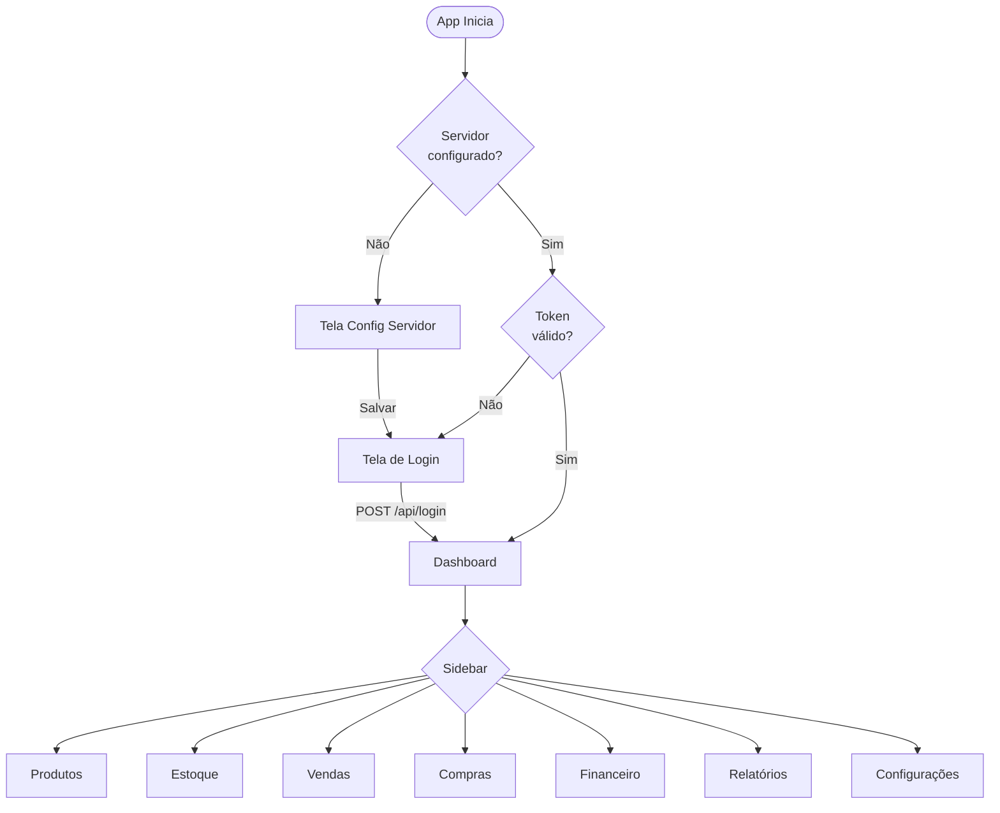

# 📋 Resumo da Implementação — UnifyTech Xenos Admin Desktop

## Objetivo

Desenvolver uma aplicação Flutter Desktop para administração de mercado, integrada ao backend Go existente (`app-backend`), sem nenhuma alteração no servidor.

---

## Arquitetura do Sistema



> [!IMPORTANT]
> Todo o controle de estado usa **Riverpod com code generation** (`@riverpod`), conforme exigido. Os arquivos `.g.dart` são gerados automaticamente via `build_runner`.

---

## Stack Tecnológico

| Camada | Tecnologia | Propósito |
|--------|-----------|-----------|
| **State Management** | `flutter_riverpod` + `riverpod_generator` | Controle de estado reativo com code gen |
| **HTTP** | `dio` | Chamadas REST com interceptor JWT |
| **Navegação** | `go_router` | Rotas com ShellRoute e redirect por auth |
| **Gráficos** | `fl_chart` | Visualização de vendas no Dashboard |
| **Tipografia** | `google_fonts` (Inter) | Fonte moderna e legível |
| **Storage Local** | `shared_preferences` | Token, config do servidor, tema |
| **Real-time** | `web_socket_channel` | Notificações em tempo real |

---

## Estrutura de Arquivos Criados

```
app-admin/lib/
│
├── main.dart                          ← Entry point + GoRouter + ProviderScope
│
├── core/
│   ├── constants/
│   │   ├── app_constants.dart         ← Defaults (host, port, keys, timeouts)
│   │   ├── api_endpoints.dart         ← 40+ endpoints mapeados do router.go
│   │   └── permissions.dart           ← Enum UserProfile com hierarquia de acesso
│   ├── theme/
│   │   ├── app_theme.dart             ← Cores, gradients, glassmorphism, spacing
│   │   ├── dark_theme.dart            ← Tema dark premium completo (Material 3)
│   │   └── light_theme.dart           ← Tema light como alternativa
│   └── utils/
│       ├── formatters.dart            ← R$, CPF, CNPJ, telefone, datas BR
│       ├── validators.dart            ← Required, email, IP, port, preço
│       └── date_utils.dart            ← Helpers de data, ranges, relative
│
├── domain/models/                     ← 12 modelos mapeados 1:1 com o backend Go
│   ├── company.dart                   ← Empresa (razão social, CNPJ, endereço)
│   ├── user.dart                      ← Usuario + LoginRequest/Response + Permissões
│   ├── product.dart                   ← Produto + Categoria + CriarProdutoRequest
│   ├── category.dart                  ← Re-export de Categoria
│   ├── supplier.dart                  ← Fornecedor + CriarFornecedorRequest
│   ├── sale.dart                      ← Venda + ItemVenda + Pagamento + FormaPgto
│   ├── purchase.dart                  ← Compra + ItemCompra + Recebimento
│   ├── stock_movement.dart            ← Movimentação + Inventário + Ajuste
│   ├── account_payable.dart           ← ContaPagar + PagarContaRequest
│   ├── account_receivable.dart        ← ContaReceber + ReceberContaRequest
│   ├── caixa.dart                     ← CaixaFisico + SessaoCaixa + Status
│   └── report.dart                    ← FluxoCaixa, Config, Auditoria, Dashboard
│
├── services/
│   ├── api_service.dart               ← Dio + JWT interceptor + testConnection()
│   └── websocket_service.dart         ← WS com auto-reconnect a cada 5s
│
├── data/
│   ├── local/
│   │   └── local_config.dart          ← SharedPreferences wrapper (token, server, theme)
│   └── repositories/                  ← 9 repositórios com parse flexível de JSON
│       ├── auth_repository.dart
│       ├── product_repository.dart
│       ├── supplier_repository.dart
│       ├── sale_repository.dart
│       ├── purchase_repository.dart
│       ├── stock_repository.dart
│       ├── finance_repository.dart
│       ├── report_repository.dart
│       └── user_repository.dart
│
└── presentation/
    ├── providers/                     ← 7 providers com @riverpod code generation
    │   ├── auth_provider.dart         ← Login/logout + token persistence
    │   ├── product_provider.dart      ← CRUD + busca reativa + filtro
    │   ├── stock_provider.dart        ← Estoque baixo + ajustes
    │   ├── sale_provider.dart         ← Vendas do dia + cancelamento
    │   ├── purchase_provider.dart     ← Criar/receber compras
    │   ├── finance_provider.dart      ← Pagar/receber + fluxo caixa
    │   └── report_provider.dart       ← Relatórios diário/mensal/ranking
    │
    ├── widgets/
    │   ├── shared_widgets.dart        ← StatusChip, KpiCard, EmptyState, LoadingOverlay
    │   └── confirmation_dialog.dart   ← Dialog reutilizável (normal/perigoso)
    │
    └── views/
        ├── shell/app_shell.dart       ← Sidebar colapsível com gradient e hover
        ├── server_config/             ← Config do servidor (1ª execução)
        ├── login/                     ← Login com glassmorphism animado
        ├── dashboard/                 ← KPIs + gráfico + alertas + tabela
        ├── products/                  ← CRUD com DataTable + busca + dialog
        ├── stock/                     ← Controle de estoque + ajuste
        ├── sales/                     ← Vendas do dia + detalhes + cancelamento
        ├── purchases/                 ← Módulo de compras
        ├── finance/                   ← Tabs: Pagar | Receber | Fluxo
        ├── reports/                   ← Tabs: Dia | Mês | Mais Vendidos
        └── settings/                  ← Tabs: Servidor | Usuários | Sistema
```

> **Total**: ~55 arquivos Dart + 38 `.g.dart` gerados pelo `build_runner`

---

## Fluxo de Navegação



---

## Design Visual

| Elemento | Implementação |
|----------|--------------|
| **Background** | Deep navy `#0B0E1A` com gradient |
| **Cards** | Glassmorphism com borda `#2A2E4A` e blur shadow |
| **Primary** | Vibrant purple `#6C63FF` |
| **Success** | Mint green `#00D9A6` |
| **Danger** | Coral red `#FF5C5C` |
| **Warning** | Warm orange `#FFB74D` |
| **Sidebar** | Gradient + nav items animados + hover effects |
| **Typography** | Google Fonts Inter (body + headings) |
| **Inputs** | Rounded 12px, filled dark, focus com primary border |
| **Buttons** | Elevated com primary gradient, outlined com border |
| **Table Rows** | Hover com primary opacity 8% |
| **Status Chips** | Color-coded badges com border e background opacity |

---

## Detalhes por Módulo

### 🖥️ Configuração do Servidor
- Campos pré-preenchidos: `localhost` e `8080`
- Validação de IP e porta
- Botão **Testar Conexão** que faz `GET /health`
- Feedback visual verde/vermelho

### 🔐 Login
- Glassmorphism card centralizado
- Círculos decorativos com gradient radial
- Fade-in animation (800ms)
- Toggle de visibilidade da senha
- Error banner animado
- Spinner no botão durante loading

### 📊 Dashboard
- **4 KPI Cards**: Vendas hoje, ticket médio, estoque baixo, total vendas
- **Gráfico de linha** (fl_chart): Vendas por hora com gradient fill
- **Lista de estoque baixo**: Com progress bars coloridas
- **Tabela de últimas vendas**: Nº venda, hora, operador, status chip, valor

### 📦 Produtos
- DataTable completa com 7 colunas
- Busca em tempo real (por nome, código, categoria)
- Dialog de criação/edição com validação
- Ícone de ⚠️ para estoque baixo
- Indicador de preço promocional

### 🏭 Estoque
- Tabela de produtos com controle de estoque
- Banner de alerta quando há itens abaixo do mínimo
- Dialog de ajuste: entrada, saída, ajuste, perda
- Invalidação automática dos providers após ajuste

### 💰 Vendas
- 3 KPI Cards (total dia, vendas, canceladas)
- Tabela com nº venda, hora, operador, caixa, itens, valor, status
- Dialog de detalhes com lista de itens e pagamentos
- Fluxo de cancelamento com motivo + senha supervisor

### 💳 Financeiro
- **Tab Contas a Pagar**: Tabela com destaque vermelho para vencidas
- **Tab Contas a Receber**: Tabela com status chips
- **Tab Fluxo de Caixa**: Entradas (verde) e saídas (vermelho)

### 📈 Relatórios
- **Tab Vendas do Dia**: Dados do endpoint `/relatorios/vendas/dia`
- **Tab Vendas do Mês**: Dados do endpoint `/relatorios/vendas/mes`
- **Tab Mais Vendidos**: Ranking com destaque top 3

### ⚙️ Configurações
- **Tab Servidor**: Host, porta, URL base
- **Tab Usuários**: Tabela + dialog de criação com perfil (caixa/supervisor/gerente/admin)
- **Tab Sistema**: Versão, backup (em breve), logout

---

## Validação Realizada

| Verificação | Resultado |
|-------------|----------|
| `flutter pub get` | ✅ 93 dependências instaladas |
| `dart run build_runner build` | ✅ 38 arquivos `.g.dart` gerados |
| `flutter analyze` | ✅ 0 errors, 0 warnings |

---

## Como Executar

```bash
# 1. Backend (já rodando)
cd app-backend
go run cmd/api/main.go

# 2. Frontend Admin
cd app-admin
flutter pub get
dart run build_runner build --delete-conflicting-outputs
flutter run -d windows
```

O app abre na tela de **Configuração do Servidor** → **Login** → **Dashboard** com sidebar completa.
